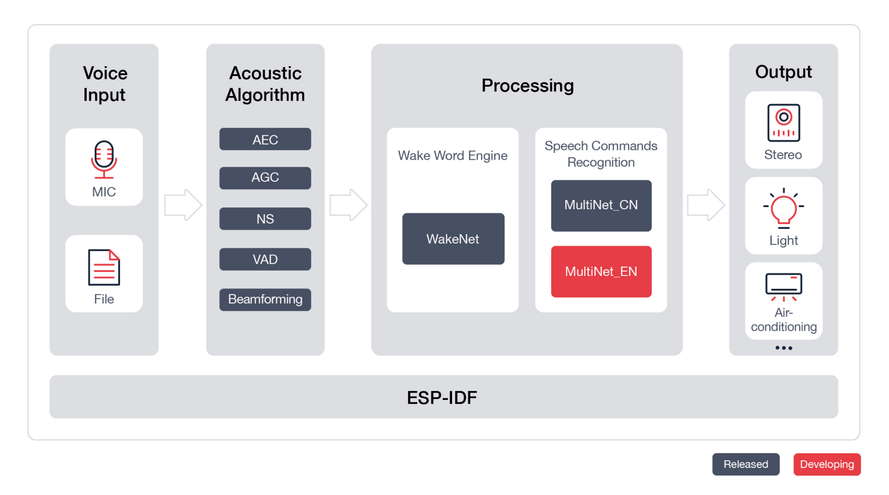

# ESP-Skainet [[English]](./README.md)

ESP-Skainet 是乐鑫推出的智能语音助手，目前支持唤醒词识别和命令词识别。

# 概述

ESP-Skainet 以最便捷的方式支持基于乐鑫的 ESP32 芯片的唤醒词识别和命令词识别应用程序的开发。使用 ESP-Skainet，您可以轻松构建唤醒词识别和命令词识别应用程序。

ESP-Skainet 的功能支持如下所示：



## 输入音频

输入音频流可以来自麦克风，或Flash/TF 卡中的 wav/pcm 等音频文件文件。

## 唤醒词识别 

唤醒词模型 [WakeNet](https://github.com/espressif/esp-sr/tree/master/wake_word_engine/README_cn.md)，致力于提供一个低资源消耗的的高性能模型，支持类似“Alexa”，“天猫精灵”，“小爱同学”等唤醒词的识别。  

目前乐鑫免费开放“Hi，乐鑫”， “你好小智”， “你好小鑫”， “hi，Jeson”唤醒词。如果用户需要其它唤醒词，乐鑫提供有唤醒词定制服务，具体可参考 [乐鑫语音唤醒词定制流程](https://github.com/espressif/esp-sr/tree/master/wake_word_engine/乐鑫语音唤醒词定制流程.md)。

## 语音命令词识别

命令词识别模型 [MultiNet](https://github.com/espressif/esp-sr/tree/master/speech_command_recognition/README_cn.md) ，致力于提供一个灵活的离线语音命词识别框架。用户可方便根据需求自定义语音命令，无需重新训练模型。  

目前模型支持类似“打开空调”，“打开卧室灯”等中文命令词识别，自定义语音命令词最大个数为 100。  

英文命令词定义将在下一版提供支持。 

## 声学算法

目前 ESP-Skainet 集成了回声消除 AEC(Acoustic Echo Cancellation)，自动增益调节 AGC(automatic_gain_control)，噪声抑制 NS(Noise Suppression)，语音活动检测 VAD(Voice Activity Detection) 和语音定向增强 Beamforming 算法。

# 快速开始

## 硬件准备

为了运行 ESP-Skainet，您需要一块集成了音频输入模块和至少** 4 MB **的外部 SPI RAM ESP32 开发板，我们在示例中使用 [ESP32-LyraT-Mini](https://docs.espressif.com/projects/esp-adf/en/latest/get-started/get-started-esp32-lyrat-mini.html) 或者 [ESP32-LyraT V4.3](https://docs.espressif.com/projects/esp-adf/en/latest/get-started/get-started-esp32-lyrat.html)

关于针对应用的具体配置，请参考每个示例中的 README.md.

## 软件准备

### 音频输入配置

在唤醒词识别和语音命令词识别期间，开发板将使用板载麦克风拾取音频数据，并将它们逐帧（30 ms，16 KHz，16位，单声道）送到 WakeNet/MultiNet 模型中。

### ESP-Skainet

确保您已经使用  `--recursive` 克隆了整个工程，命令如下：

```
git clone --recursive https://github.com/espressif/esp-skainet.git 
```
如果您克隆的项目没有使用 `--recursive` 选项，请先转到 `esp-skainet` 目录并运行 `git submodule update --init` 命令。

### ESP-IDF

在本工程中，我们使用 [ESP-IDF v3.2](https://github.com/espressif/esp-idf/releases/v3.2) 版本。如果您之前已经搭建过 ESP-IDF 环境并且不想更改现有的变量，可以将 IDF_PATH 环境变量配置为新的 ESP-IDF 的路径。

获取更多关于搭建 ESP-IDF 环境的细节，请参考 [Getting Started Guide for the stable ESP-IDF version](https://docs.espressif.com/projects/esp-idf/en/stable/get-started-cmake/index.html)


# Components

组件是 SDK 中最重要的架构，其中包含驱动和算法。

## hardware_driver

hardware_driver 组件包含了 ESP32-LyraT-Mini 开发板和 ESP32-LyraT V4.3 开发板的驱动。


## esp-sr

[esp-sr](https://github.com/espressif/esp-sr/tree/master) 组件包含了 ESP-Skainet 中的 API， 包括唤醒词识别、语音命令词识别和前端声学算法。

# 示例

[examples](examples) 文件夹包含了使用 ESP-Skainet API 搭建的一些应用示例。

选取垃圾分类（garbage_classification）示例代码举例：

1. 进入示例文件夹 `esp-skainet/examples/garbage_classification`
```
cd esp-skainet/examples/garbage_classification
```

2. 编译和烧写
```
make
make flash monitor
```

3. 用户可以使用 make menuconfig 命令添加或修改语音命令。

获取更多细节，请阅读示例中的 README.md

# 资源

* [在 GitHub 上参考问题](https://github.com/espressif/esp-skainet/issues) 如果你发现了一个 bug 或者提出一个 feature，请在开启新问题前参考已经存在的问题。

* 如果你对开发 ESP-Skainet 有兴趣, 清参考 [Contributions Guide](https://esp-idf.readthedocs.io/en/latest/contribute/index.html).
